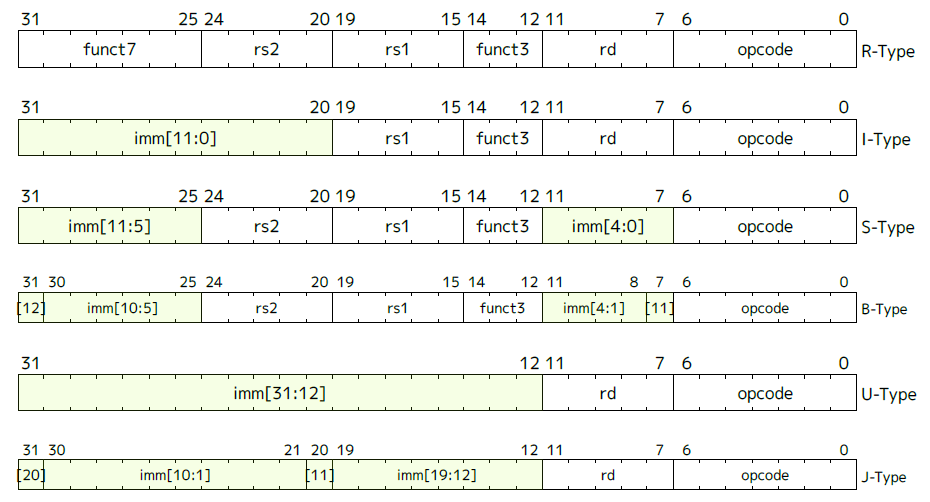

# RTFM & RTFSC

指令实现依据：



根据生成的反汇编：

```assembly

/home/xiaoma/ics2024/am-kernels/tests/cpu-tests/build/dummy-riscv32-nemu.elf:     file format elf32-littleriscv


Disassembly of section .text:

80000000 <_start>:
80000000:	00000413          	li	s0,0	# li 是伪指令
80000004:	00009117          	auipc	sp,0x9
80000008:	ffc10113          	addi	sp,sp,-4 # 80009000 <_end>
8000000c:	00c000ef          	jal	80000018 <_trm_init>

80000010 <main>:
80000010:	00000513          	li	a0,0
80000014:	00008067          	ret	# 特别注意的是ret是简化版的jal

80000018 <_trm_init>:
80000018:	ff010113          	addi	sp,sp,-16
8000001c:	00000517          	auipc	a0,0x0
80000020:	01c50513          	addi	a0,a0,28 # 80000038 <_etext>
80000024:	00112623          	sw	ra,12(sp)
80000028:	fe9ff0ef          	jal	80000010 <main>
8000002c:	00050513          	mv	a0,a0
80000030:	00100073          	ebreak
80000034:	0000006f          	j	80000034 <_trm_init+0x1c>

```

对着这里的反汇编分别实现对应指令。首先需要注册 `TYPE_J` 并实现RISCV的 J 类型指令立即数的提取。根据手册，分别提取并拼接指令`[31] | [30-21] | [20] | [19-12]` 这20位（还要注意到立即数的组成是分成了4段来拼接，需要分别进行处理），并且由于 J 类型指令要求立即数必为偶数，对齐2字节，最后再整体左移一位，符号扩展到32位：

```c
#define immJ() do { *imm = SEXT(((BITS(i, 31, 31) << 19) | BITS(i, 30, 21) | (BITS(i, 20, 20) << 10) | (BITS(i, 19, 12) << 11)) << 1, 21); } while (0)

// Expansion：
#define immJ() do { *imm = SEXT(( \
(BITS(i, 31, 31) << 19) | \
BITS(i, 30, 21) | \
(BITS(i, 20, 20) << 10) | \
(BITS(i, 19, 12) << 11) \
) << 1, 21); Log(ANSI_FG_CYAN "%#lx\n" ANSI_NONE, *imm); } while(0)
```

在`decode_oprand()`中添加对 J 类型的处理，只需要提取立即数即可（目标寄存器是统一提取的）：

```c
static void decode_operand(Decode *s, int *rd, word_t *src1, word_t *src2, word_t *imm, int type) {
  uint32_t i = s->isa.inst;
  int rs1 = BITS(i, 19, 15);
  int rs2 = BITS(i, 24, 20);
  *rd     = BITS(i, 11, 7);
  switch (type) {
    case TYPE_I: src1R();          immI(); break;
    case TYPE_U:                   immU(); break;
    case TYPE_S: src1R(); src2R(); immS(); break;
    case TYPE_J:                   immJ(); break;
    case TYPE_N: break;
    default: panic("unsupported type = %d", type);
  }
}
```


实现 `jal` 机器码匹配和具体行为：

> The jump and link (JAL) instruction uses the J-type format, where the J-immediate encodes a signed offset in multiples of 2 bytes. The offset is sign-extended and added to the address of the jump instruction to form the jump target address. Jumps can therefore target a ± 1 MiB range. **JAL stores the address of the instruction following the jump ('pc'+4) into register rd**. The standard software calling convention uses 'x1' as the return address register and 'x5' as an alternate link register.

```c
INSTPAT("??????? ????? ????? ??? ????? 11011 11", jal    , J, s->dnpc = s->pc + imm; R(rd) = s->pc + 4);
```

此外还有 I 类型的 `jalr` 指令，`ret` 是它的简化版。

> The indirect jump instruction JALR (jump and link register) uses the I-type encoding. The target address is obtained by adding the sign-extended 12-bit I-immediate to the register rs1, then setting the least-significant bit of the result to zero. The address of the instruction following the jump (pc+4) is written to register rd. Register x0 can be used as the destination if the result is not required.

```c
INSTPAT("??????? ????? ????? 000 ????? 11001 11", jalr   , I, s->dnpc = (src1 + imm) & ~(word_t)1; R(rd) = s->pc + 4);
```

现在运行

```shell
make ARCH=riscv32-nemu ALL=dummy run
```

执行dummy程序就可以HIT GOOD TRAP了。

